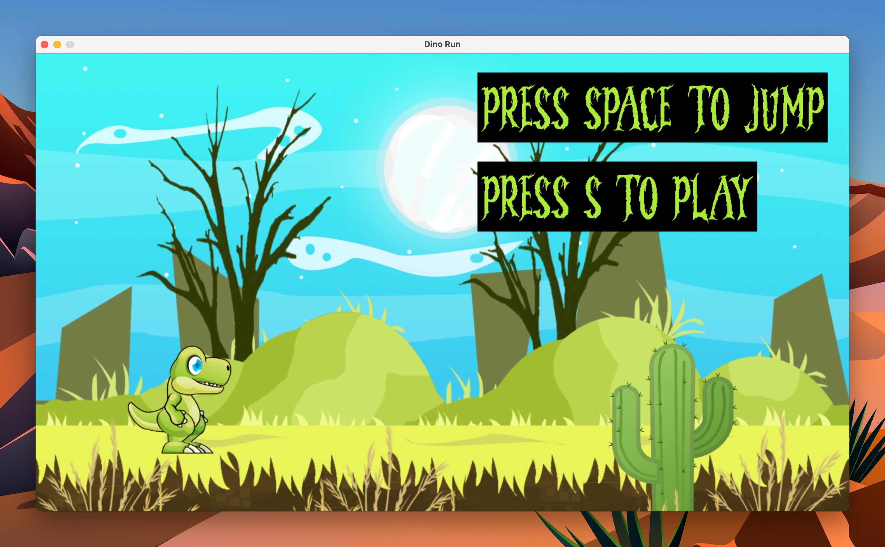

# Dino Run
It is a Clone of Google Chrome's T-Rex-Run Game with Good Graphics.


## Requirements
- SDL2
- SDL2_image
- SDL2_mixer
- SDL2_ttf

## Macos build command
```bash
./build.sh
```

## Macos run command
```bash
./bin/main
```

## Macos build and run command
```bash
./build.sh && ./bin/main
```

## Assets Sources
### BG_Png [2D SCROLLING BACKGROUND By MIMIMJ] --> https://www.gamedevmarket.net/asset/2d-scrolling-background/
   - ground.png
   - mountains.png
   - plant.png
   - plateau.png
   - sky.png
### Dino.png [CUTE DINO - FREE SPRITE] --> https://www.gameart2d.com/free-dino-sprites.html
### Cactus.png --> https://www.clipartkey.com/view/bTJxT_cactus-icon-transparent-background-cactus-icon/
### BG_Music [TRIPLE KILL!] --> https://www.gamedevmarket.net/asset/triple-kill/
   - Dirby_day.mp3
   - Doom.mp3
### Music_Fx [CLASSIC FOOTSTEPS SFX] --> https://www.gamedevmarket.net/asset/classic-footsteps-sfx/
   - Rocky_ground_jump0.wav
   - Rocky_ground_jump1.wav
   - Rocky_ground_running_loop0.wav
### font.otf [Danger Night Font] ---> https://www.fontspace.com/danger-night-font-f86845/